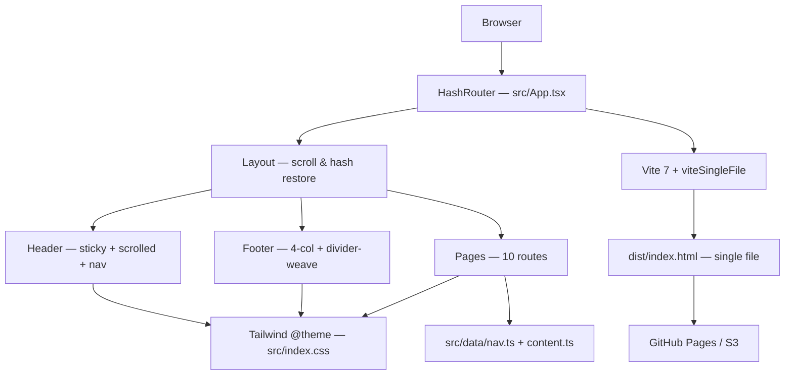

# Blessed Stanley Rother Shrine


> **Static pilgrimage site for the National Shrine of Blessed Stanley Rother, Oklahoma City** — plan a visit, learn the story of the shepherd who stayed, and explore the Pilgrim Center, Shrine Church & Tepeyac Hill.

A single-file React SPA cloned from [rothershrine.org](https://www.rothershrine.org/) for pilgrims, parish groups, and school tours. Content is file-backed (`src/data/*`) with no backend or CMS — ships as one `dist/index.html` to GitHub Pages or S3. Warm editorial design (Fraunces + Source Sans 3) on a bespoke `shrine-*` token palette; `HashRouter` ensures deep-links work on static hosts without a server.

## Key Features

Every row below is implemented — no placeholders.

|  | Feature | What it does |
|---|---|---|
| 🏛️ | **Home — hero + quick facts** | Full-bleed hero ("The Shepherd Who Stayed"), hours/location/Mass/feast facts, welcome, grounds preview, upcoming events. |
| 📖 | **Blessed Stanley Rother** | 8-entry life timeline (1935–2023) from `lifeTimeline` — farm boy → ordination 1963 → Tz'utujil mission → martyrdom 1981 → beatification 2017. |
| ⛪ | **What to See (3 sites)** | Pilgrim Center, Shrine Church & Tomb Chapel, Tepeyac Hill — anchor-linked sections from `whatToSee` with images and detail lists. |
| 🧭 | **Pilgrimage / Visit Planning** | Hours, location, Mass schedule, group-visit guidance — canonical route `/pilgrimage` with legacy aliases `/visit-planning` + `/hours-location`. |
| 📰 | **News & Events** | Feast Day (July 28), Pilgrim Rosary Walk, TASTE + Venerable Voices series from `upcomingEvents`. Alias `/news-and-events`. |
| 🤝 | **Volunteer** | Serve opportunities for docents, hospitality, and grounds. |
| 💛 | **Give** | 8 giving options (`General Fund`, `Pipe Organ`, `Apla's Circle`, etc. from `givingOptions`). Alias `/shrinegift`. |
| ❓ | **FAQ + NotFound** | 6 FAQs (admission, Mass, accessibility, burial) and a `*` catch-all `NotFound` page. |

## Architecture

### Tech Stack

| Layer | Technology | Version | Purpose |
|---|---|---|---|
| UI | React | `19.2.6` | Functional components + hooks only |
| Routing | React Router | `7.18.2` | `HashRouter` + `Layout` outlet + alias routes |
| Build | Vite | `7.3.2` | HMR dev, single-file prod build |
| Styling | Tailwind CSS + `@tailwindcss/vite` | `4.1.17` | CSS-first `@theme` tokens in `src/index.css` |
| Language | TypeScript | `5.9.3` | `strict` + `noUnusedLocals/Params`, `bundler` mode, `@` alias |
| Icons | lucide-react | `1.34.0` | Header/footer + page iconography |
| Utils | clsx + tailwind-merge | `2.1.1` / `3.4.0` | `cn()` class merging |
| Bundling | vite-plugin-singlefile | `2.3.0` | Inlines all assets into one `index.html` |
| Fonts | Google Fonts | — | `Fraunces` (display) + `Source Sans 3` (body) via `index.html` |

Versions match `package.json` / `package-lock.json`.

### System Diagram



`HashRouter` is intentional — static hosts have no SPA fallback, so `/#/pilgrimage` works without server rewrites.

## File Hierarchy

```
📂 rothershrine/
├── 📄 index.html            # lang, viewport, meta description, Google Fonts, #root
├── 📄 vite.config.ts        # plugins [react, tailwindcss, viteSingleFile] + alias @→src
├── 📄 tsconfig.json         # ES2020 / ESNext / bundler / strict / @/* paths
├── 📄 package.json          # scripts: dev / build / preview
├── 📂 public/
│   └── 📂 images/           # hero-shrine.jpg, shepherd-emblem.jpg — ref as /images/*.jpg
├── 📂 src/
│   ├── 📄 App.tsx           # HashRouter + 15 routes (7 alias pairs + 3 hash anchors + *)
│   ├── 📄 main.tsx          # StrictMode + createRoot
│   ├── 📄 index.css         # @theme shrine-* tokens + @layer base/utilities
│   ├── 📂 components/
│   │   ├── 📄 Layout.tsx    # Outlet + scroll/hash restoration
│   │   ├── 📄 Header.tsx    # sticky, scrolled blur, hover dropdown, mobile drawer
│   │   ├── 📄 Footer.tsx    # 4-col Explore / Get Involved / Visit Us
│   │   ├── 📄 PageHero.tsx  # maroon hero primitive (image opacity + gradients)
│   │   └── 📂 ui/           # Button (4 variants), Container, SectionHeading
│   ├── 📂 pages/            # Home, AboutRother, History, WhatToSee, Pilgrimage, NewsEvents, Volunteer, Give, FAQ, NotFound
│   ├── 📂 data/
│   │   ├── 📄 nav.ts        # primaryNav / footerNav — single source for Header & Footer
│   │   └── 📄 content.ts    # lifeTimeline, whatToSee, faqs, upcomingEvents, givingOptions
│   └── 📂 utils/
│       └── 📄 cn.ts         # twMerge(clsx) — always merge via cn()
├── 📂 docs/
│   └── 📄 prompts.md        # Intent lineage
├── 📄 CLAUDE.md             # Deep conventions (authoritative)
└── 📄 AGENTS.md             # Compact agent cheat sheet
```

## Quick Start

**Requirements:** Node.js ≥20 (Vite 7), `pnpm` preferred (`npm` works).

```bash
# 1 — Clone
git clone <repo-url> rothershrine && cd rothershrine

# 2 — Install
pnpm install
# or: npm install

# 3 — Run (HMR)
pnpm dev
# → Local: http://localhost:5173

# 4 — Production build (single file)
pnpm build
# → dist/index.html  ~367 kB (gzip ~107 kB), all assets inlined

# Preview prod build
pnpm preview
# → http://localhost:4173
```

### Verify Setup

```bash
npx tsc --noEmit          # type gate — expect no output (clean)
pnpm build                # expect: "✓ built in ~3s" + "Inlining: index-*.js / style-*.css"
ls -lh dist/index.html    # expect: single HTML file, no separate assets chunk
```

| Check | Expected |
|---|---|
| `pnpm dev` | Vite ready on `:5173`, HMR active |
| `npx tsc --noEmit` | Exit `0`, no errors |
| `pnpm build` | `dist/index.html` exists, gzip ~107 kB |
| `pnpm preview` | Prod preview on `:4173`, all alias routes + `#hash` anchors navigate |

## Design System

Tokens live in `src/index.css` `@theme`. Extend there — never use arbitrary `bg-[#...]`.

| Token | Hex | Usage |
|---|---|---|
| `shrine-cream` | `#faf5eb` | Page background |
| `shrine-parchment` | `#f2e9d8` | Section bands, card fills |
| `shrine-stone` | `#ded0b4` | Borders, dividers |
| `shrine-ink` | `#2c2418` | Primary text |
| `shrine-charcoal` | `#423a2c` | Secondary text |
| `shrine-maroon-500` | `#7c2a25` | Eyebrow, links |
| `shrine-maroon-600` | `#691f1e` | Header icon, secondary button, footer tile |
| `shrine-maroon-700` | `#55191a` | Display heading |
| `shrine-maroon-900` | `#351012` | Hero + footer background |
| `shrine-gold-300` | `#e2bf72` | Eyebrow on dark, header accent |
| `shrine-gold-500` | `#c3963f` | Primary button |
| `shrine-pine-600` | `#26402f` | Accent / weave |
| `shadow-shrine` | `0 20px 60px -20px rgba(53,16,18,.35)` | Hero, cards, emblem |

**Typography:** `Fraunces` (display, quote, `font-display` / `h1–h4`) + `Source Sans 3` (body) — loaded in `index.html`, set in `@theme` + `@layer base`. Utilities: `text-balance`, `bg-adobe-texture`, `divider-weave`.

## Deployment

Single-file deploy — no server, no env vars, no rewrites needed.

```bash
pnpm build                # produces dist/index.html
# GitHub Pages — push dist/index.html to gh-pages or serve dist/ as artifact
# S3 / CloudFront — upload dist/index.html as index.html
pnpm preview              # smoke-test before publish
```

Why `HashRouter`: deep-links like `/#/what-to-see#tepeyac-hill` resolve without host fallback config. Switching to `BrowserRouter` would require a `404.html` redirect shim.

## Contributing

This repo follows the six-phase workflow in `CLAUDE.md` (ANALYZE → PLAN → VALIDATE → IMPLEMENT → VERIFY → DELIVER).

- **TDD:** `RED → GREEN → REFACTOR → Commit` — one cycle per commit; write a failing test before fixing a bug.
- **Commits:** Conventional Commits — `feat:`, `fix:`, `docs:`, `chore:`, `refactor:`, `style:` — atomic, subject ≤72 chars.
- **Branches:** `feat/<slug>`, `fix/<slug>`, `docs/<slug>` — short-lived (1–3 days), squash-merge.
- **Conventions:** `PascalCase.tsx` for components/pages, `camelCase.ts` for data/utils, `PrimaryNav` single-source, alias routes preserved, `cn()` for merges, `shrine-*` tokens only.
- **Pre-push gate:** `npx tsc --noEmit && pnpm build` — both green.

> `skills/` is a symlink to `~/.pi/agent/skills` and is `.gitignore`d — don't commit it. See `AGENTS.md` for the compact cheat sheet.

## Troubleshooting

| Issue | Solution |
|---|---|
| `pnpm dev` port in use (`:5173`) | `pnpm dev -- --port 5174` or kill the other Vite process. |
| `Cannot find module '@/…'` or alias error | Ensure `vite.config.ts` alias `@→src` and `tsconfig.json` `paths {"@/*":["src/*"]}` stay in sync; restart dev server. |
| Hash anchor doesn't scroll (`#/what-to-see#pilgrim-center` lands at top) | Target `id` missing — verify `id="pilgrim-center"` exists in `WhatToSee.tsx`; `Layout.tsx` falls back to `window.scrollTo` when not found. |
| `tsc --noEmit` fails on unused var | `noUnusedLocals/Params` is `true` — remove or prefix with `_` only if intentionally unused. |

## License

Private — all rights reserved. © National Shrine of Blessed Stanley Rother, Archdiocese of Oklahoma City. No `LICENSE` file is published.

---

**Docs:** [`docs/prompts.md`](docs/prompts.md) · [`CLAUDE.md`](CLAUDE.md) · [`AGENTS.md`](AGENTS.md)
